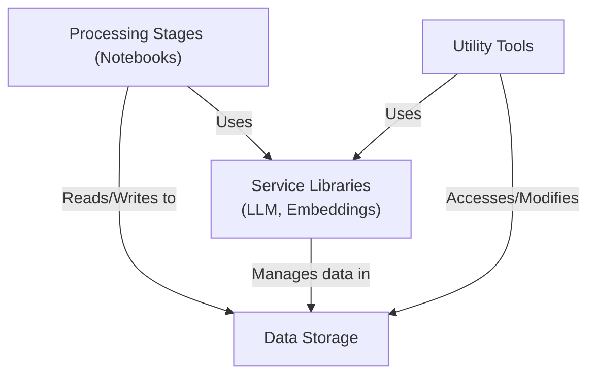

# Topic Modelling With LLMs on Hacker News: Discovering the Impact of AI on Software Development

This project collects, deduplicates, and analyses Hacker News stories and comments related to Large Language Models (LLMs) and software development. It extracts keywords, computes embeddings, and clusters topics using modern NLP and ML techniques.

## Features

- **Automated Data Collection:** Fetches stories from Hacker News using relevant LLM/DEV keywords.
- **Deduplication:** Cleans and deduplicates story data.
- **Keyword Extraction:** Uses LLMs to extract research topic-related keywords from stories.
- **Embeddings & Clustering:** Computes vector embeddings for keywords and clusters them to discover topic groups.
- **Comment Downloading:** Fetches and processes comments for each research topic-related story.

## Architectural Design

The project's architecture is composed of four primary components. These components collaborate to execute a multi-stage data processing and analysis pipeline.



### Main Components

- **Processing Stages (Notebooks)**:
    - This group represents the core sequential logic of the application.
    - It orchestrates the overall workflow, taking raw data through various stages of transformation, enrichment, and analysis.
    - Each stage typically consumes outputs from a previous stage and produces inputs for subsequent stages or final analytical results.
- **Service Libraries**:
    - These are collections of specialised, reusable code providing core functionalities.
    - Key services include:
        - **Large Language Model (LLM) Interface**: Manages communication and task execution with external LLMs (e.g., for natural language understanding, generation, or analysis).
        - **Embedding Management**: Handles the creation, storage, and retrieval of vector embeddings.
    - These libraries are primarily utilised by the Processing Stages and can also be used by Utilities for ad-hoc tasks.
    - Includes testing modules to ensure the reliability of these core services.
- **Utility Tools**:
    - This component consists of various helper scripts and tools.
    - They perform auxiliary functions such as ad-hoc analyses and operational tasks that support the main processing pipeline.
    - Utilities can leverage the Service Libraries and interact with the Data Storage component.
- **Data Storage**:
    - This component acts as the central persistence layer for the project.
    - It is responsible for storing:
        - Raw input data (e.g., downloaded stories).
        - Intermediate processed data.
        - Structured analytical data (e.g., extracted keywords, comments).
        - Vector embeddings.
        - Temporary files generated during processing.
    - It facilitates data exchange between the different Processing Stages.

This architectural design ensures a modular and sequential approach to data processing, where distinct responsibilities are handled by different component groups, promoting reusability and clarity.

## Installation

1. **Clone the repository:**
    
    ```bash
    git clone https://github.com/hccheung117/topic-modelling-llm.git
    cd topic-modelling-llm
    ```
    
2. **Install dependencies:**
This project uses Python 3.8+ and the following packages:
    - `pandas`
    - `numpy`
    - `requests`
    - `tqdm`
    - `matplotlib`
    - `scikit-learn`
    - `kneed`
    - `python-dotenv`
3. **Set up environment variables:**
Create a `.env` file in the project root with the following variables:
    
    ```env
    LLM_API_KEY=your_llm_api_key
    LLM_BASE_URL=https://your-llm-api-endpoint
    ```
    

## Usage

- Run the Jupyter notebooks in order:
    1. `01_download_stories.ipynb` – Download stories from Hacker News.
    2. `02_deduplicate_stories.ipynb` – Deduplicate and clean the stories.
    3. `03_extract_story_keywords.ipynb` – Extract LLM and DEV keywords using an LLM API.
  4. `04_embed_story_keywords.ipynb` – Compute embeddings.
  5. `05_cluster_story_embeddings.ipynb` – Cluster keywords and analyse topics.
  6. `06_download_comments.ipynb` – Download and process comments for each story.
- The scripts and notebooks are modular; you can adapt or extend them for your own research.

## Testing

Unit tests for the embedding storage logic are provided in `test_embeddingio.py`:

```bash
python -m unittest test_embeddingio.py
```
